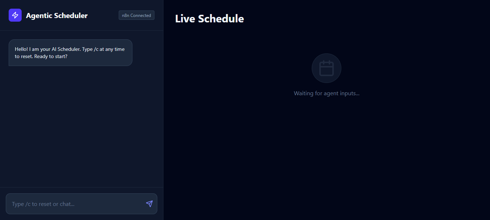

# Agentic AI Scheduler 🤖📅

An intelligent, conversational interface for managing daily schedules. Unlike traditional calendar apps, this system uses **Agentic AI patterns** to reason about time, detect conflicts, and negotiate slots via natural language.

 **

## ✨ Key Features

* **Conversational Interface:** chat with your scheduler naturally (e.g., *"Plan my day starting at 8 AM"* or *"Move the gym to 5 PM"*).
* **Smart Conflict Detection:** The system analyzes your existing slots and warns you if a new request overlaps with an existing commitment.
* **Sequential Slot Filling:** Uses a "Chain of Thought" approach to gather missing details (Wake time → Focus work → Habits).
* **Dual Mode Architecture:**
    * **Demo Mode:** Runs entirely client-side with a mock reasoning engine for instant testing.
    * **Production Mode:** Connects to **n8n workflows** for real-time LLM processing and calendar integration.
* **Optimistic UI:** Immediate visual feedback on the schedule board while the agent "thinks."

## 🛠️ Tech Stack

* **Frontend:** React (Vite), Tailwind CSS
* **Icons:** Lucide React
* **State Management:** React Hooks (`useState`, `useEffect`)
* **Backend / AI:** n8n (Node-based Workflow Automation) or Local Mock Logic

## 🚀 Getting Started

### Prerequisites
* Node.js (v16 or higher)
* npm or yarn

### Installation

1.  **Clone the repository**
    ```bash
    git clone [https://github.com/be-pratham/Agentic-AI-Scheduler.git](https://github.com/be-pratham/Agentic-AI-Scheduler.git)
    cd Agentic-AI-Scheduler
    ```

2.  **Install dependencies**
    ```bash
    npm install
    ```

3.  **Environment Setup**
    Create a `.env` file in the root directory to configure the n8n webhook (optional for Demo mode):
    ```env
    VITE_N8N_WEBHOOK_URL=your_n8n_webhook_url_here
    ```

4.  **Run the application**
    ```bash
    npm run dev
    ```

## 🧠 How It Works

### The Agentic Workflow
1.  **Input:** User types a command (e.g., *"Change Morning Routine to 7am"*).
2.  **Parsing:** The agent extracts the intent (Update) and entities (Activity: "Morning Routine", Time: "7am").
3.  **Reasoning:**
    * *Is the slot free?* -> Yes: Update.
    * *Is the slot taken?* -> No: Trigger conflict warning (`"Careful—you already have 'Deep Work' then."`).
4.  **Action:** The React state updates the visual schedule board instantly.

## 📂 Project Structure

```text
/src
├── components
│   ├── AgentScheduler.jsx  # Main Chat & Calendar Interface
│   └── ...
├── schedule
│   ├── n8n.js              # API Service for Webhook connection
│   └── mockApi.js          # Simulation logic for demos
└── App.jsx